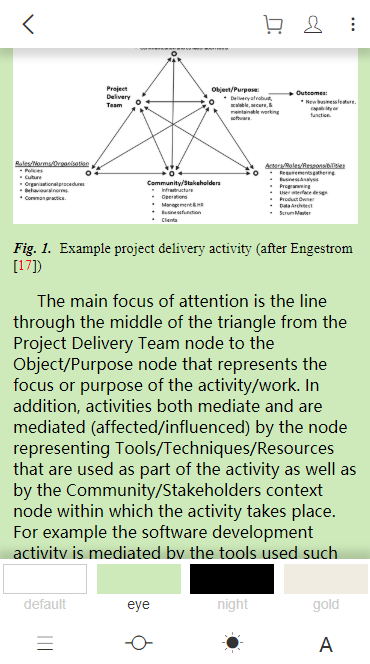
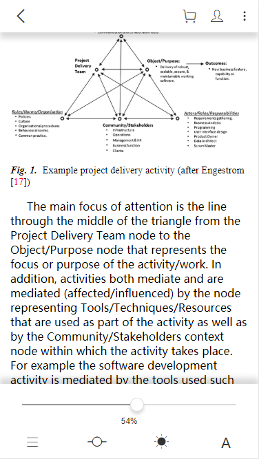

# vue-epub-demo
进入根目录后执行“npm install“ 命令

然后再执行“npm run dev”运行

### 描述

用vue写的epub电子书的Demo，在此demo中主要用到了epubjs来实现的。

实现的主要功能有：

 	1. 字号设置
 	2. 主题设置
 	3. 进度设置
 	4. 目录设置
 	5. 点击左侧上一页，点击右侧下一页
 	6. 点击中间区域显示或者隐藏标题栏和菜单栏

### 效果图

